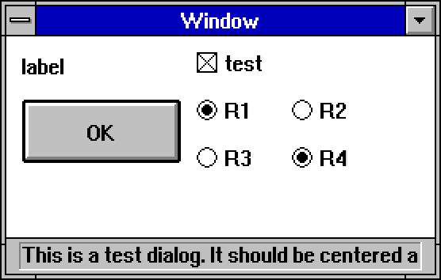

# XUI

Small Java UI toolkit for Project Zomboid-style overlays and standalone LWJGL test windows.



## Features

- Win3.1 theme included.
- Basic controls: labels, buttons, checkboxes, and radio buttons.
- Draggable and resizable windows with status text.
- JSON-backed themes and atlas resources under `src/main/resources/themes`.
- Standalone `TestApp` for local development and visual checks.

## Requirements

- Java 17
- Gradle

LWJGL and Gson are resolved from Maven Central. The standalone demo does not require a Project Zomboid install.

## Run The Demo

From this directory:

```sh
gradle run
```

Useful demo arguments:

```sh
gradle run --args="--center --scale 2"
gradle run --args="--theme pz --width 480 --height 260"
```

Use `--help` to see all `TestApp` options.

## Layout

- `src/main/java/me/zed_0xff/XUI`: toolkit sources and demo app.
- `src/main/resources/themes`: theme definitions.
- `src/main/resources/fonts`: bitmap font metadata.
